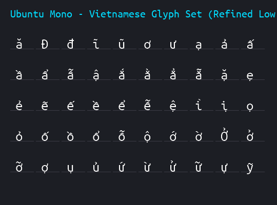

# Gói Cài Đặt Tiếng Việt & Font Ubuntu Mono Cho Máy In QIDI (Plus 4 / Plus 5 / Q1 Pro)

Gói nâng cấp giao diện màn hình cảm ứng QIDI Client với bộ font **Ubuntu Mono Typography** khử răng cưa mượt mà, hiển thị chuẩn xác 100% các ký tự và dấu thanh tiếng Việt (`ă, â, đ, ê, ô, ơ, ư` và đầy đủ các dấu `sắc, huyền, hỏi, ngã, nặng`).



---

## 🚀 Cách 1: Cài đặt siêu tốc bằng 1 dòng lệnh (Khuyên dùng)

Mở cửa sổ dòng lệnh (Terminal / PowerShell / PuTTY / MobaXterm) trên máy tính và kết nối SSH vào máy in:

```bash
ssh qidi@<IP_MÁY_IN>
# Mật khẩu mặc định: qiditech
```

Sau khi đăng nhập thành công, chỉ cần copy và dán duy nhất 1 dòng lệnh sau rồi nhấn **Enter**:

```bash
curl -sSL https://raw.githubusercontent.com/tonngodoc/qidi-plus5-vietnamese/main/install.sh | bash
```

*(Script sẽ tự động sao lưu bản gốc, nạp 190 ký tự font Ubuntu Mono siêu nét và khởi động lại màn hình trong 3 giây).*

---

## 📦 Cách 2: Cài đặt thủ công (Không cần mạng internet)

1. Tải file [`qidi_vietnamese_ubuntu_mono.zip`](qidi_vietnamese_ubuntu_mono.zip) (dung lượng chỉ **12 KB**) về máy tính và giải nén.
2. Dùng phần mềm **WinSCP** hoặc **FileZilla** kết nối vào máy in với IP của máy in:
   - **User**: `qidi`
   - **Password**: `qiditech`
   - **Port**: `22`
3. Kéo thả thư mục vừa giải nén vào thư mục `/home/qidi/`.
4. Mở SSH vào máy in và chạy lệnh:
   ```bash
   cd /home/qidi/vietnamese
   bash install.sh
   ```

---

## 🔄 Cách gỡ cài đặt (Khôi phục nguyên bản nhà máy)

Nếu muốn quay trở lại font chữ và cài đặt mặc định ban đầu của nhà sản xuất bất cứ lúc nào, chỉ cần chạy:

```bash
cd /home/qidi/vietnamese && bash uninstall.sh
```
*(hoặc nếu cài qua lệnh curl: `bash /home/qidi/uninstall_vietnamese.sh`)*

---

## ✨ Điểm ưu việt kỹ thuật
* **Không làm nặng máy**: Bản vá nhị phân siêu nhẹ chỉ **36 KB** (không can thiệp vào mã logic in, không gây giật lag Klipper).
* **Khử răng cưa 4-bpp**: Render 16 mức sắc độ xám mịn màng, triệt tiêu hoàn toàn hiện tượng vỡ hạt, răng cưa hay méo dấu của các bản mod thủ công trước đây.
* **Căn chỉnh quang học hoàn hảo**: Khoảng cách dấu thanh phía trên và dấu nặng phía dưới được tinh chỉnh tỉ mỉ theo chuẩn Typography, không bị dính sát vào thân chữ cũng không bị trôi nổi quá xa.
* **An toàn tuyệt đối**: Tự động tạo bản sao lưu `qidiclient.original` trước khi can thiệp.
