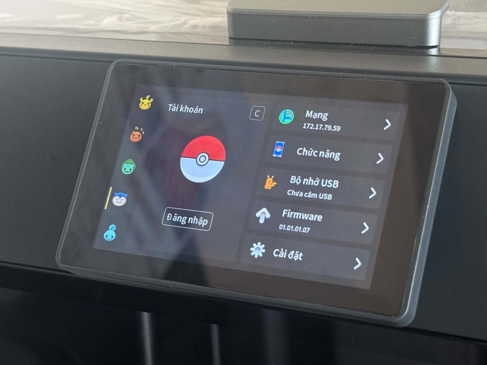

# Gói Cài Đặt Tiếng Việt Toàn Diện & Font Ubuntu Mono Cho Máy In QIDI Plus 5 (Bản Nội Địa)

<div align="center">

<a href="https://hawklabs.vn">
  
</a>

<p><strong>HA.WK LABS</strong> • <em>Hardware & Adaptive Works</em></p>

[](https://github.com/Klipper3d/klipper)
[](LICENSE)
[-orange.svg)](https://qidi3d.com)
[](https://github.com/tonngodoc/qidi-plus5-vietnamese)

</div>

Gói nâng cấp giao diện màn hình cảm ứng QIDI Client **Việt hóa toàn diện 100%** (toàn bộ menu điều khiển, cài đặt, và **100% các hộp thoại thông báo lỗi, cảnh báo sự cố in**) kết hợp với bộ font **Ubuntu Mono Typography** khử răng cưa mượt mà, hiển thị chuẩn xác từng dấu thanh tiếng Việt (`ă, â, đ, ê, ô, ơ, ư` và đầy đủ các dấu `sắc, huyền, hỏi, ngã, nặng`).

> [!IMPORTANT]
> **Khả năng tương thích:**
> - **Dành cho:** Máy in **QIDI Plus 5 - Bản Nội địa** (Chưa thử nghiệm với bản Quốc tế).
> - **Firmware đã kiểm thử thực tế:** `01.01.01.07` (Kích thước file `qidiclient`: `90,312,400 bytes`, MD5: `dfe9db00a13e40cf08d8a376d09a9aca`).
> - **Cơ chế bảo vệ an toàn (Safety Pre-check):** Trình cài đặt tự động kiểm tra chữ ký nhị phân và kích thước file trước khi nạp. Nếu phát hiện sai dòng máy (Q1 Pro, Plus 4...) hoặc phiên bản firmware không khớp, script sẽ **tự động từ chối cài đặt** để bảo vệ màn hình an toàn tuyệt đối.
> - **Cơ chế ngôn ngữ:** Bản vá thay thế trực tiếp vào slot ngôn ngữ Tiếng Nga (`ru_RU`) của nhà sản xuất thành **Tiếng Việt 100%** (bao gồm 488 chuỗi giao diện & thông báo lỗi). Các ngôn ngữ phổ biến khác (Tiếng Anh, Tiếng Trung...) vẫn được giữ nguyên vẹn 100% và có thể chuyển đổi qua lại bình thường trong menu Cài đặt.

---

### 📸 Hình ảnh thực tế trên màn hình máy in QIDI Plus 5 (Bản Nội địa)

<div align="center">

| Giao diện Điều khiển (Tab 2) | Giao diện Quạt & Làm mát |
| :---: | :---: |
|  |  |

| Menu Cài đặt hệ thống | Trang Thông tin & Tài khoản |
| :---: | :---: |
|  |  |

</div>

---

### 🔤 Bảng mẫu 50 ký tự tiếng Việt đã được tinh chỉnh


---

## 🚀 Cách 1: Cài đặt siêu tốc bằng 1 dòng lệnh (Khuyên dùng)

Mở cửa sổ dòng lệnh (Terminal / PowerShell / PuTTY / MobaXterm) trên máy tính và kết nối SSH vào máy in:

```bash
ssh qidi@<IP_MÁY_IN>
# Mật khẩu mặc định: qiditech
```

Sau khi đăng nhập thành công, chỉ cần copy và dán duy nhất 1 dòng lệnh sau rồi nhấn **Enter**:

```bash
curl -sSL https://raw.githubusercontent.com/tonngodoc/qidi-plus5-vietnamese/main/install.sh | bash
```

*(Script sẽ tự động sao lưu bản gốc sang `qidiclient.original`, kiểm tra chữ ký an toàn, nạp 190 ký tự font Ubuntu Mono siêu nét và khởi động lại màn hình trong 3 giây).*

---

## 📦 Cách 2: Cài đặt thủ công (Không cần mạng internet)

1. Tải file [`qidi_vietnamese_ubuntu_mono.zip`](qidi_vietnamese_ubuntu_mono.zip) (dung lượng chỉ **27 KB**) về máy tính và giải nén.
2. Dùng phần mềm **WinSCP** hoặc **FileZilla** kết nối vào máy in với IP của máy in:
   - **User**: `qidi`
   - **Password**: `qiditech`
   - **Port**: `22`
3. Kéo thả thư mục vừa giải nén vào thư mục `/home/qidi/`.
4. Mở SSH vào máy in và chạy lệnh:
   ```bash
   cd /home/qidi/qidi-vietnamese
   bash install.sh
   ```

---

## 🔄 Cách gỡ cài đặt (Khôi phục nguyên bản nhà máy)

Nếu muốn quay trở lại font chữ và cài đặt mặc định ban đầu của nhà sản xuất bất cứ lúc nào, chỉ cần chạy:

```bash
bash /home/qidi/uninstall_vietnamese.sh
```

---

## ✨ Điểm ưu việt kỹ thuật
* **Bảo vệ phần cứng tuyệt đối (Safety Pre-check)**: Kiểm tra mã băm và kích thước tệp thực thi trước khi ghi, chống hỏng hóc hoặc đen màn hình nếu chạy sai máy.
* **Việt hóa 100% không sót**: Dịch sạch toàn bộ bảng ngôn ngữ tiếng Nga sang tiếng Việt, bao gồm 100% các thông báo lỗi (lỗi slice file, cảnh báo kẹt nhựa, phát hiện sợi spaghetti, bù rung cộng hưởng, nhật ký lỗi, thông báo cảm biến nhiệt, mesh bàn, kết nối BOX...).
* **Không làm nặng máy**: Bản vá nhị phân siêu nhẹ chỉ **76 KB** (không can thiệp vào mã logic in, không gây giật lag Klipper).
* **Khử răng cưa 4-bpp**: Render 16 mức sắc độ xám mịn màng, triệt tiêu hoàn toàn hiện tượng vỡ hạt, răng cưa hay méo dấu của các bản mod thủ công trước đây.
* **Căn chỉnh quang học hoàn hảo**: Khoảng cách dấu thanh phía trên và dấu nặng phía dưới được tinh chỉnh tỉ mỉ theo chuẩn Typography, không bị dính sát vào thân chữ cũng không bị trôi nổi quá xa.
* **An toàn tuyệt đối**: Tự động tạo bản sao lưu `qidiclient.original` trước khi can thiệp.

---

## 📜 Bản quyền & Tác giả (Credits & License)

- Phát hành theo giấy phép [MIT License](LICENSE) — Miễn phí & Mã nguồn mở cho cộng đồng 3D Printing.
- **Tác giả & Đơn vị phát triển**: **TÔN NGỘ ĐỘC** ([HA.WK LABS](https://hawklabs.vn) — *Hardware & Adaptive Works*).
